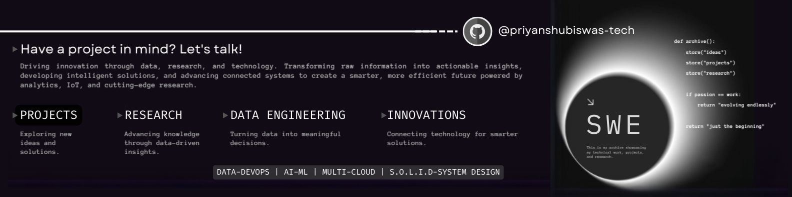

# Hello World! I'm Priyanshu, a Data Enthusiast & Researcher 
🛠 I’m working on a data Engineering and data science projects. 🤝 I’m looking to collaborate on Python, NLP, Neural Networks, MLOps (Databricks, MLflow), Scikit-learn, LLMs, and automation tech. 🌱 I’m currently learning Advanced Machine Learning, Generative AI, and Edge Computing for IoT   💬 Ask me about my research and case study on the IoT project "Farmlab", focusing on rural agricultural communities, and their responses.

# 💻 Tech Stack:
## 🧠 Programming Languages

---

## 🌩️ Cloud & Data Services

---

## 🗄️ Databases & Warehouses

---

## ⚙️ Data Engineering & Streaming

---

## 🤖 AI, ML & Analytics

---

## 🧩 DevOps & Infrastructure

---

## 💻 Collaboration & Productivity

---

## 🎨 Design, Media & Creativity

<picture>
  <source media="(prefers-color-scheme: dark)" srcset="https://raw.githubusercontent.com/tobiasmeyhoefer/tobiasmeyhoefer/output/github-snake-dark.svg" />
  <source media="(prefers-color-scheme: light)" srcset="https://raw.githubusercontent.com/tobiasmeyhoefer/tobiasmeyhoefer/output/github-snake.svg" />
  
</picture>
  
<!-- Proudly created with GPRM ( https://gprm.itsvg.in ) -->
